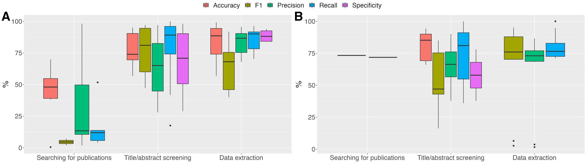
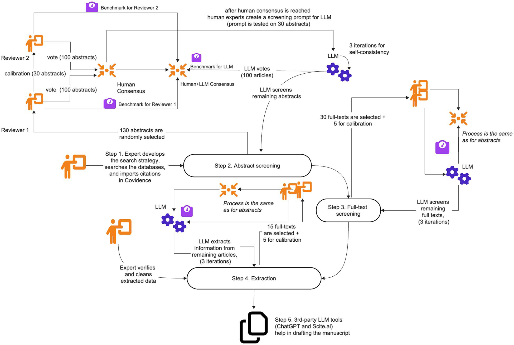

## Como este workshop funciona {.smaller}

::: {.bsl-destaque}
**Pergunta-guia:** uma busca assistida por IA é um **método** — que se descreve, se justifica e se reproduz — ou um **atalho**?
:::

| | Bloco | Min |
|---|---|---|
| 1 | A web que os robôs leem — e por que isso chega à sua revisão | 25 |
| 2 | A saída: bases legíveis por máquina | 20 |
| — | *Intervalo / instalar o que falta* | 10 |
| 3 | **Mão na massa**: a mesma pergunta em duas ferramentas + R | 40 |
| 4 | Demonstração: agente com MCP | 10 |
| 5 | Fechamento: modelos abertos, acesso e como declarar | 15 |

::: {.fonte}
Slides, código e todas as referências: <https://provetelab.org/ia-revisao-literatura/>
:::

## O que você precisa ter aberto agora {.smaller}

::: {.columns}
::: {.column width="50%"}
**Contas gratuitas** (criar antes de começar):

- Consensus — <https://consensus.app>
- Undermind — <https://undermind.ai>

**R** com os pacotes:

```r
install.packages(c("openalexR", "litsearchr", "tidyverse"))
```
:::
::: {.column width="50%"}
**Traga uma coisa sua:** uma revisão (sua ou de alguém do seu grupo) **cuja lista de referências você conhece bem**.

É com ela que vamos medir o que as ferramentas acham — e o que elas perdem.
:::
:::

::: {.bsl-destaque}
Se der problema de instalação, **não pare o workshop por isso**: os blocos 1, 2, 4 e 5 não dependem de R.
:::

# 0 · De onde viemos {.bsl-secao background-color="#f3eee3"}

## A palestra anterior parou em "declare" {.smaller}

Em *IA na redação científica* fechamos com cinco regras. Uma delas era:

::: {.bsl-citacao}
Verifique cada referência até o DOI, e confira se ela diz o que você afirma.
:::

Isso resolve o **reporte**. Não resolve a pergunta anterior, que é a deste workshop:

::: {.bsl-destaque}
Se a busca em si passou a ser feita por uma máquina, **a busca virou parte do método** — e método se descreve, se justifica e se reproduz. Estamos preparados para descrever o que essas ferramentas fazem?
:::

::: {.fonte}
Slides da palestra anterior: <https://provetelab.org/ia-escrita-cientifica/>
:::

## Três teses que este workshop defende {.smaller}

1. **A web deixou de ser legível por programas** — e isso tem consequências técnicas concretas para qualquer ferramenta que prometa "ler a literatura".

2. **Alucinação de referência e bloqueio de acesso são dois problemas diferentes**, com causas diferentes e soluções diferentes. Confundi-los leva a diagnósticos errados.

3. **Busca assistida por IA tem alta precisão e baixa sensibilidade.** Isso não a torna inútil — torna-a adequada para um conjunto específico de tarefas, e inadequada para outro. Saber qual é qual é o conteúdo técnico do workshop.

::: {.bsl-destaque}
Se você sair daqui com só uma coisa, que seja a terceira.
:::

# 1 · A web que os robôs leem {.bsl-secao background-color="#f3eee3"}

## Em junho de 2026, os robôs passaram as pessoas {.smaller}

::: {.columns}
::: {.column width="45%"}
[57,5% / 42,5%]{.numero}
[divisão das requisições HTTP entre bots e humanos, segundo os dados da Cloudflare]{.numero-legenda}
:::
::: {.column width="55%"}
> "Welp, that happened faster than I predicted. Thought it would be end of 2027, then early 2027, but agentic traffic growing so fast that bots have now passed human traffic online for the first time in the Internet's history."

— **Matthew Prince**, CEO da Cloudflare, 3 de junho de 2026
:::
:::

::: {.bsl-alerta}
**Cuidado com este número.** É a medição de *uma* empresa, sobre *a fração da web que passa por ela*, com uma classificação de tráfego recente — o próprio Prince diz que o dado "is a bit messy". Use como ordem de grandeza, não como estatística.
:::

::: {.fonte}
Tom's Hardware (04/06/2026), a partir de postagem de M. Prince: <https://www.tomshardware.com/tech-industry/artificial-intelligence/bots-have-now-passed-human-traffic-online-cloudflare-boss-laments-says-agentic-traffic-wasnt-expected-to-eclipse-real-people-until-next-year>
:::

## O Brasil não é a média mundial {.smaller}

A Cloudflare publica o mesmo indicador por país, em tempo real:

::: {.bsl-destaque}
**Ao vivo agora:** <https://radar.cloudflare.com/bots/br>
:::

O que olhar na tela: a proporção bot/humano do Brasil, a série temporal, e — se der tempo — comparar com `/bots/us`.

::: {.fonte}
Cloudflare Radar. Os números mudam; não vale a pena fixá-los em um slide.
:::

## "Teoria da internet morta": o que ela acerta e o que ela erra {.smaller}

::: {.columns}
::: {.column width="50%"}
**O que a metáfora acerta**

- Uma fração crescente do conteúdo online é gerada por máquina.
- Uma fração crescente do *tráfego* é de máquina.
- Sinais que usávamos para avaliar relevância (visualizações, engajamento, links) ficaram menos informativos.
:::
::: {.column width="50%"}
**O que ela erra**

- Na formulação original é uma **teoria da conspiração** — supõe intenção coordenada de ocultar pessoas reais.
- Não é uma hipótese testável do jeito que é enunciada.
- Nada disso é necessário para o argumento deste workshop.
:::
:::

::: {.bsl-alerta}
**Use como figura de linguagem, declarando que é figura de linguagem.** O fenômeno mensurável — tráfego e conteúdo automatizados — é suficiente e não precisa de conspiração.
:::

## Por que uma página deixou de ser um documento {.smaller}

::: {.bsl-alerta}
**Correção de um erro comum:** não é que "o HTML5 foi substituído por JSON e CSS". HTML continua sendo o formato da página. O que mudou foi **quem monta a página**.
:::

- **Antes (web de documentos):** o servidor devolvia HTML com o conteúdo dentro. `curl` numa URL trazia o texto.
- **Agora (*single-page applications*):** o servidor devolve um HTML praticamente vazio + JavaScript. O JavaScript chama uma **API que devolve JSON**, e monta o conteúdo **no navegador**.

::: {.bsl-destaque}
Consequência: um programa que apenas baixa a URL recebe **a casca, não o conteúdo**. Para ver o que você vê, ele precisaria executar um navegador inteiro.
:::

::: {.fonte}
Isso é *client-side rendering*. Não é uma conspiração contra robôs — é uma escolha de arquitetura feita por outras razões (interatividade, custo de servidor). O efeito colateral é que a web ficou mais cara de ler por máquina.
:::

## Demonstração 1 · a casca vazia {.smaller}

Ao preparar estes slides, tentei buscar programaticamente o número de bots do Brasil na página da Cloudflare Radar. O que voltou:

> "Based on the webpage content provided, **no specific numerical data is shown for Brazil's bot vs. human traffic share**. […] The page appears to be a dashboard interface where visualizations would typically be displayed, but those data points are not present."

::: {.bsl-destaque}
A página **existe**, **abriu**, **não foi bloqueada** — e mesmo assim não tinha número nenhum. Os números chegam depois, por JSON, quando um navegador executa o JavaScript.
:::

::: {.fonte}
Este é o modo de falha mais comum e o menos percebido: a ferramenta não erra, ela simplesmente **não vê**.
:::

## Por que o robô é barrado: quatro motivos distintos {.smaller}

| Motivo | Quem impõe | Mecanismo |
|---|---|---|
| **Carga de servidor** | qualquer site | limite de taxa, captcha, *rate limiting* |
| **Termos de uso / `robots.txt`** | o site | convenção; obedecida por crawlers "bem-comportados" |
| **Segurança** | CDN / WAF | detecção de bot, desafio de JavaScript, captcha |
| **Licenciamento de conteúdo** | editora / CDN | bloqueio por padrão + cobrança por acesso |

::: {.bsl-destaque}
O quarto motivo é o novo. Desde **1º de julho de 2025** a Cloudflare bloqueia *crawlers* de IA **por padrão** em sites novos e lançou o *pay-per-crawl*: o acesso deixou de ser livre e passou a ser negociado.
:::

::: {.fonte}
Cloudflare, *Content Independence Day: no AI crawl without compensation!* (01/07/2025): <https://blog.cloudflare.com/content-independence-day-no-ai-crawl-without-compensation/>
:::

## Demonstração 2 · o 403 {.smaller}

Tentativa de ler programaticamente um artigo de acesso aberto na Wiley Online Library:

```
Error: There was an error while fetching: The page returned a 403 client error
```

E na PubMed Central, a mesma tentativa devolveu **uma página de reCAPTCHA do Google** — não o artigo.

::: {.bsl-destaque}
O artigo é **aberto**. A licença permite. O **acesso automatizado**, não. Acesso aberto e acesso legível por máquina são coisas diferentes — e a segunda vem sendo restringida.
:::

::: {.fonte}
Ambos os casos ocorreram durante a preparação destes slides, em setembro de 2026. O mesmo artigo foi obtido depois por uma **API** (é exatamente essa a saída do bloco 2).
:::

## O erro de raciocínio que eu quero evitar {.smaller}

::: {.bsl-alerta}
**Bloqueio de acesso *não* é a causa da invenção de referências.** São dois mecanismos independentes. Tratar um como causa do outro leva à conclusão errada de que "se o site abrisse, o modelo não inventaria".
:::

::: {.columns}
::: {.column width="50%"}
**Mecanismo A — geração paramétrica**

O modelo gera o próximo token a partir de uma memória comprimida dos dados de treino. Ele produz a *forma* de uma citação.

Um **DOI é uma string arbitrária de alta entropia**: não há regularidade linguística que o modelo possa aprender. É, literalmente, o pior tipo de objeto para um modelo generativo produzir de memória.
:::
::: {.column width="50%"}
**Mecanismo B — ancoragem ruim**

Ferramentas com busca (RAG) recuperam documentos e geram a partir deles. Se a recuperação traz pouco, ou traz a casca vazia do slide anterior, o modelo **preenche a lacuna com plausibilidade**.

Aqui o bloqueio *agrava* — mas o erro continua sendo de geração, não de acesso.
:::
:::

## Os dois mecanismos, lado a lado {.smaller}

```{=html}
<svg viewBox="0 0 1120 360" width="100%" style="max-height:430px" role="img"
     aria-label="Diagrama comparando dois mecanismos de erro: geração paramétrica e ancoragem ruim.">
  <defs>
    <marker id="setaA" markerWidth="9" markerHeight="7" refX="8" refY="3.5" orient="auto">
      <polygon points="0 0, 9 3.5, 0 7" fill="#1c6e8c"/>
    </marker>
  </defs>
  <!-- painel A -->
  <rect x="8" y="8" width="530" height="344" rx="8" fill="#ffffff" stroke="#e3dccd"/>
  <text x="28" y="42" font-family="sans-serif" font-size="21" font-weight="600" fill="#144f64">A · Geração paramétrica</text>
  <text x="28" y="68" font-family="sans-serif" font-size="15" fill="#59616b">LLM sem busca — acontece com a internet aberta</text>

  <rect x="30" y="92" width="150" height="54" rx="6" fill="#f3eee3" stroke="#e3dccd"/>
  <text x="105" y="117" text-anchor="middle" font-family="sans-serif" font-size="15" fill="#2d3748">pergunta</text>
  <text x="105" y="136" text-anchor="middle" font-family="sans-serif" font-size="13" fill="#59616b">do usuário</text>
  <line x1="182" y1="119" x2="214" y2="119" stroke="#1c6e8c" stroke-width="2" marker-end="url(#setaA)"/>

  <rect x="218" y="92" width="170" height="54" rx="6" fill="#f3eee3" stroke="#e3dccd"/>
  <text x="303" y="117" text-anchor="middle" font-family="sans-serif" font-size="15" fill="#2d3748">memória</text>
  <text x="303" y="136" text-anchor="middle" font-family="sans-serif" font-size="13" fill="#59616b">comprimida do treino</text>
  <line x1="390" y1="119" x2="422" y2="119" stroke="#1c6e8c" stroke-width="2" marker-end="url(#setaA)"/>

  <rect x="426" y="92" width="86" height="54" rx="6" fill="#fdf4f4" stroke="#a32f2f"/>
  <text x="469" y="117" text-anchor="middle" font-family="sans-serif" font-size="14" fill="#a32f2f">citação</text>
  <text x="469" y="135" text-anchor="middle" font-family="sans-serif" font-size="13" fill="#a32f2f">plausível</text>

  <rect x="30" y="176" width="482" height="80" rx="6" fill="#fdf4f4" stroke="#a32f2f" stroke-dasharray="4 3"/>
  <text x="46" y="202" font-family="sans-serif" font-size="14" font-weight="600" fill="#a32f2f">Por que o DOI é o pior caso</text>
  <foreignObject x="46" y="210" width="450" height="44">
    <div xmlns="http://www.w3.org/1999/xhtml" style="font-family:sans-serif;font-size:13.5px;line-height:1.35;color:#2d3748">
      String arbitrária de alta entropia: não há regularidade linguística a aprender.
      O modelo acerta a <em>forma</em> (prefixo/sufixo) e erra o conteúdo.
    </div>
  </foreignObject>

  <rect x="30" y="272" width="482" height="60" rx="6" fill="#f3eee3" stroke="#e3dccd"/>
  <foreignObject x="44" y="280" width="456" height="48">
    <div xmlns="http://www.w3.org/1999/xhtml" style="font-family:sans-serif;font-size:13.5px;line-height:1.35;color:#2d3748">
      <strong style="color:#144f64">Solução:</strong> não pedir referências ao modelo.
      Dar a ele referências recuperadas de uma base com identificador persistente.
    </div>
  </foreignObject>

  <!-- painel B -->
  <rect x="582" y="8" width="530" height="344" rx="8" fill="#ffffff" stroke="#e3dccd"/>
  <text x="602" y="42" font-family="sans-serif" font-size="21" font-weight="600" fill="#144f64">B · Ancoragem ruim</text>
  <text x="602" y="68" font-family="sans-serif" font-size="15" fill="#59616b">Ferramenta com busca (RAG) — aqui o bloqueio agrava</text>

  <rect x="604" y="92" width="118" height="54" rx="6" fill="#f3eee3" stroke="#e3dccd"/>
  <text x="663" y="124" text-anchor="middle" font-family="sans-serif" font-size="15" fill="#2d3748">busca</text>
  <line x1="724" y1="119" x2="748" y2="119" stroke="#1c6e8c" stroke-width="2" marker-end="url(#setaA)"/>

  <rect x="752" y="92" width="176" height="54" rx="6" fill="#fdf4f4" stroke="#a32f2f"/>
  <text x="840" y="114" text-anchor="middle" font-family="sans-serif" font-size="14" fill="#a32f2f">recupera pouco</text>
  <text x="840" y="133" text-anchor="middle" font-family="sans-serif" font-size="12" fill="#a32f2f">403 · captcha · casca vazia</text>
  <line x1="930" y1="119" x2="950" y2="119" stroke="#1c6e8c" stroke-width="2" marker-end="url(#setaA)"/>

  <rect x="954" y="92" width="142" height="54" rx="6" fill="#fdf4f4" stroke="#a32f2f"/>
  <text x="1025" y="114" text-anchor="middle" font-family="sans-serif" font-size="13.5" fill="#a32f2f">preenche a lacuna</text>
  <text x="1025" y="133" text-anchor="middle" font-family="sans-serif" font-size="12.5" fill="#a32f2f">com plausibilidade</text>

  <rect x="604" y="176" width="492" height="80" rx="6" fill="#fdf4f4" stroke="#a32f2f" stroke-dasharray="4 3"/>
  <text x="620" y="202" font-family="sans-serif" font-size="14" font-weight="600" fill="#a32f2f">O erro continua sendo de geração</text>
  <foreignObject x="620" y="210" width="460" height="44">
    <div xmlns="http://www.w3.org/1999/xhtml" style="font-family:sans-serif;font-size:13.5px;line-height:1.35;color:#2d3748">
      O bloqueio não faz o modelo inventar: ele apenas <em>amplia a lacuna</em> que o
      mecanismo A já preenche sozinho.
    </div>
  </foreignObject>

  <rect x="604" y="272" width="492" height="60" rx="6" fill="#f3eee3" stroke="#e3dccd"/>
  <foreignObject x="618" y="280" width="466" height="48">
    <div xmlns="http://www.w3.org/1999/xhtml" style="font-family:sans-serif;font-size:13.5px;line-height:1.35;color:#2d3748">
      <strong style="color:#144f64">Solução:</strong> checar cada DOI contra o CrossRef,
      e exigir da ferramenta a lista de fontes que ela de fato leu.
    </div>
  </foreignObject>
</svg>
```

::: {.fonte}
Diagrama original · CC BY 4.0. Abrir o site bloqueado resolve **B**, e não toca em **A**.
:::


## Demonstração ao vivo · a alucinação acontecendo [8 min]{.cronometro} {.smaller}

::: {.bsl-exercicio}
#### Protocolo — façam junto comigo

1. **Alguém da sala dá o tema.** Quanto mais específico e mais nosso, melhor:
   um gênero de anuro, uma região, um processo.
2. Eu peço a um LLM **sem busca** (chat comum, sem "deep research", sem navegação):
   *"Liste 5 artigos revisados por pares sobre <tema>, com autores, ano, periódico e DOI."*
3. Projeto a resposta. Todo mundo lê. **Parece perfeita.**
4. Rodo o verificador no R, ao vivo, contra a API do CrossRef.
5. **Contamos no quadro:** de 5, quantos existem?
:::

::: {.bsl-destaque}
**A aposta que eu faço agora, antes de rodar:** pelo menos um DOI vai apontar para um artigo **que existe mas não é aquele**. Esse é o caso mais perigoso — sobrevive a uma conferência apressada.
:::

## O verificador (rodando ao vivo) {.smaller}

```r
library(httr2); library(purrr); library(tibble)

checa_doi <- function(doi) {
  r <- request("https://api.crossref.org/works") |>
    req_url_path_append(doi) |>
    req_user_agent("workshop-ppgba (mailto:seu.email@ufms.br)") |>
    req_error(is_error = \(resp) FALSE) |>
    req_perform()

  if (resp_status(r) != 200)
    return(tibble(doi = doi, existe = FALSE, titulo = NA_character_))

  m <- resp_body_json(r)$message
  tibble(doi = doi, existe = TRUE, titulo = m$title[[1]])
}

dois <- c("10.1111/2041-210X.13268",   # existe
          "10.1038/s41586-026-99999-x") # não existe

map(dois, checa_doi) |> list_rbind()
```

::: {.bsl-alerta}
**`existe = TRUE` não encerra a checagem.** Falta a pergunta que só você responde: *o título que voltou é o que a citação dizia?* Um DOI válido colado numa referência errada é o modo de falha que passa despercebido.
:::

## A escala, medida na literatura publicada {.smaller}

Zhao et al. (2026) verificaram **111 milhões de referências em 2,5 milhões de artigos e preprints** do arXiv, bioRxiv, SSRN e PubMed Central:

::: {.columns}
::: {.column width="42%"}
[146.932]{.numero}
[referências inexistentes em trabalhos de **2025** — e os autores chamam de estimativa **conservadora**]{.numero-legenda}
:::
::: {.column width="58%"}
- Aumento **abrupto** a partir da adoção ampla de LLMs.
- Concentradas em campos de adoção rápida de IA e em textos com marcadores linguísticos de escrita assistida.
- O SSRN — majoritariamente ciências sociais — lidera a prevalência.
- "Preprint moderation and journal publication processes capture only a fraction of these errors."
:::
:::

::: {.bsl-alerta}
**É preprint, não passou por revisão por pares.** Trate como a melhor estimativa disponível, não como número fechado — e diga isso à plateia, porque é exatamente a postura que o workshop defende.
:::

::: {.fonte}
Zhao Z, Wang Y, Stuart T, De Vaan M, Ginsparg P, Yin Y (2026). *LLM hallucinations in the wild: Large-scale evidence from non-existent citations*. arXiv:2605.07723 · Cobertura: Stokel-Walker C, *Nature* (14/05/2026) <https://www.nature.com/articles/d41586-026-01545-1> e Naddaf M, Quill E, *Nature* (01/04/2026) <https://www.nature.com/articles/d41586-026-00969-z>
:::

## Quem é mais atingido {.smaller}

No mesmo levantamento, as citações inexistentes **não se distribuem ao acaso**:

- aparecem mais em trabalhos de **equipes pequenas** e de **pesquisadores em início de carreira**;
- e, quando inventadas, atribuem crédito desproporcionalmente a **pesquisadores já proeminentes** e a **homens**.

::: {.bsl-destaque}
Ou seja: quem tem menos estrutura de verificação erra mais, e o erro **reforça a hierarquia de prestígio que já existe**. A alucinação não é ruído aleatório — ela tem direção.
:::

::: {.bsl-alerta}
Some isso ao que vamos ver adiante (Kim et al. 2025): a taxa de invenção é maior para a literatura de países de baixa renda. Duas assimetrias, no mesmo sentido.
:::

::: {.fonte}
Zhao et al. (2026), arXiv:2605.07723 — preprint.
:::

## Quanto se inventa, em condição controlada {.smaller}

O levantamento acima mede o que **sobreviveu até a publicação**. Este mede o processo na origem: Seifi & Seyfi (2026) submeteram 10 tópicos de neurointensivismo a **três modelos sem acesso à web** (zero-shot, recuperação desligada), pedindo 10 referências por tópico — 300 referências, conferidas às cegas por dois especialistas contra PubMed, DOI, Google Scholar e CrossRef:

- **55,0%** (165/300) continham alguma imprecisão de citação;
- **28,3%** (85/300) eram **completamente fabricadas**;
- por modelo: DeepSeek-V3 23% (fabricação 8%), GPT-5.3 69% (27%), Grok-4 73% (**50%**).
- Concordância entre avaliadores excelente: **κ = 0,91** (IC 95%: 0,86–0,96).

::: {.bsl-destaque}
Metade das referências do modelo pior **não existia**. E elas "appear complete and credible" — é exatamente esse o problema.
:::

::: {.fonte}
Segundo o PubMed: Seifi A, Seyfi A (2026). *Hallucination Rate of Peer-Reviewed Citations Generated by Large Language Models in Neurocritical Care*. Crit Care Explor 8(9):e1474. [doi:10.1097/CCE.0000000000001474](https://doi.org/10.1097/CCE.0000000000001474)
:::

## Uma lição de medição, de graça {.smaller}

Um segundo estudo, no mesmo ano, com desenho parecido (1.800 referências de anatomia):

- ChatGPT 5.2: **23,2%** de alucinação — a **menor** taxa
- Gemini 3 Pro: 45,8% · DeepSeek V3.2: **47,5%** — a **maior**

::: {.bsl-alerta}
**Os dois estudos invertem o ranking dos modelos.** No primeiro, DeepSeek é o melhor e GPT o pior; no segundo, o contrário.
:::

::: {.bsl-destaque}
O que os dois **concordam**: as taxas são altas em termos absolutos, e verificação humana é obrigatória. O que **não se sustenta**: qualquer frase do tipo "use o modelo X, que inventa menos". Versões, prompts, domínios e critérios de julgamento diferem — estamos medindo um alvo móvel com réguas incomparáveis.
:::

::: {.fonte}
Segundo o PubMed: Ülkir M, Paslı B (2026). *Reference Hallucination, Citation Reliability, and Readability of Large Language Models in Anatomy-Related Question Answering*. Clin Anat. [doi:10.1002/ca.70187](https://doi.org/10.1002/ca.70187)
:::

## E a alucinação não é uniforme no globo {.smaller}

Kim, Kipchumba & Min (2025) validaram **3.451 citações** geradas por quatro modelos contra a API do CrossRef, estratificando por país de origem da publicação:

::: {.bsl-destaque}
As taxas de alucinação **passaram de 80% para publicações de países de baixa renda** — e a fabricação cresceu forte para publicações dos anos 2020 em todas as regiões.
:::

Na ordem de importância dos fatores: **modelo > nível de renda do país > período de publicação**.

::: {.bsl-alerta}
Para nós isso é concreto: a literatura **brasileira, latino-americana e africana** é justamente a que o modelo conhece pior — e portanto a que ele mais inventa. Guarde isto para o bloco 5.
:::

::: {.fonte}
Kim E, Kipchumba F, Min S (2025). *Geographic Variation in LLM DOI Fabrication: Cross-Country Analysis of Citation Accuracy Across Four Large Language Models*. Publications 13(4):49. [doi:10.3390/publications13040049](https://doi.org/10.3390/publications13040049)
:::

## O que muda na revisão de literatura {.smaller}

::: {.bsl-destaque}
Um LLM **sem busca** não é uma ferramenta de revisão de literatura. É um gerador de texto com formato de bibliografia.
:::

Isso não é um problema a ser consertado com prompt melhor. É uma propriedade do mecanismo.

A saída é mudar a arquitetura: **em vez de pedir referências ao modelo, dar referências ao modelo** — recuperadas de uma base com identificadores persistentes, por um canal legível por máquina.

É disso que trata o bloco 2.

# 2 · Bases legíveis por máquina {.bsl-secao background-color="#f3eee3"}

## O que faz uma base ser "legível por máquina" {.smaller}

Não é ter um site bonito. São três coisas:

1. **Uma API pública e documentada** — um endereço que devolve **dados estruturados** (JSON), não uma página para humanos.
2. **Identificadores persistentes** — DOI, ORCID, ISSN, ROR. É o que permite dizer "este objeto é aquele objeto" sem adivinhação.
3. **Uma licença que permite o uso** — reuso, redistribuição, mineração.

::: {.bsl-destaque}
Quando as três existem, o problema do bloco 1 desaparece: não há casca vazia para renderizar, não há captcha, e o DOI **vem da base** em vez de ser gerado pelo modelo.
:::

## OpenAlex {.smaller}

::: {.columns}
::: {.column width="52%"}
- Mantido pela **OurResearch**, organização sem fins lucrativos (mesma gente do Unpaywall).
- **Dados em CC0** — domínio público. Pode baixar o dump inteiro.
- API pública, sem chave obrigatória (basta declarar um e-mail de contato para entrar no *pool* rápido).
- Sucessor do Microsoft Academic Graph, descontinuado em 2021.
:::
::: {.column width="48%"}
**O que isso significa na prática**

É a única base grande de metadados bibliográficos que **você pode replicar inteira na sua máquina**. Uma busca feita nela é auditável por terceiros sem assinatura.

Para reprodutibilidade, essa é a propriedade que importa.
:::
:::

::: {.fonte}
<https://openalex.org> · documentação da API: <https://docs.openalex.org>
:::

## Semantic Scholar {.smaller}

- Mantido pelo **Allen Institute for AI (Ai2)**, instituto de pesquisa sem fins lucrativos em Seattle.
- Mais de **200 milhões** de registros; API pública com chave gratuita.
- Diferencial: além de metadados, trabalha **contextos de citação** e *embeddings* — é o que permite busca semântica em vez de só booleana.

::: {.bsl-destaque}
**Por que isso importa para o bloco 3:** boa parte das ferramentas comerciais que vamos testar roda **em cima do Semantic Scholar**. Elas não têm um índice próprio da literatura — têm uma camada de LLM sobre o índice do Ai2.
:::

::: {.fonte}
<https://www.semanticscholar.org> · API: <https://api.semanticscholar.org>
:::

## O que a evidência diz sobre a cobertura {.smaller}

Culbert et al. (2025) compararam a cobertura de referências do OpenAlex com Web of Science e Scopus num corpus compartilhado de **16,8 milhões de publicações** (2015–2022):

- Números médios de referências e taxas de cobertura interna **comparáveis** aos das duas bases proprietárias.
- ORCID: **92% no OpenAlex** vs. 16% na WoS e 32% na Scopus.
- Resumos: 87% no OpenAlex vs. 92% nas outras duas.

::: {.bsl-alerta}
Os autores não fazem propaganda: recomendam **"caution when utilising OpenAlex for scientometric studies due to the volatility and data quality issues"**. Cobertura comparável não é qualidade idêntica — o OpenAlex muda entre versões.
:::

::: {.fonte}
Culbert JH, Hobert A, Jahn N, Haupka N, Schmidt M, Donner P, Mayr P (2025). *Reference coverage analysis of OpenAlex compared to Web of Science and Scopus*. Scientometrics. [doi:10.1007/s11192-025-05293-3](https://doi.org/10.1007/s11192-025-05293-3)
:::

## Cada ferramenta herda o viés do seu corpus {.smaller}

| Ferramenta | Sobre qual base busca | Quem controla |
|---|---|---|
| **Consensus** | Semantic Scholar + OpenAlex + crawl próprio (>200 M) | empresa privada |
| **Undermind** | busca agêntica iterativa; corpus **não declarado** na página | empresa privada |
| **Elicit** | Semantic Scholar (~126 M na avaliação de 2025) | empresa privada |
| **LeapSpace** | ecossistema **Elsevier** (Scopus/ScienceDirect) | Elsevier |
| **Scite** | contextos de citação sobre corpus próprio | empresa privada |
| **NotebookLM** | **nada** — só o que você subir | Google |

::: {.bsl-alerta}
**Se todo mundo busca no mesmo índice, a "segunda opinião" é ilusória.** Rodar Consensus e Elicit e obter listas parecidas não confirma nada: as duas estão perguntando à mesma base. Concordância entre ferramentas ≠ evidência.
:::

## O risco de usar só isso {.smaller}

::: {.bsl-destaque}
Nenhuma dessas bases indexa bem: literatura cinzenta, teses brasileiras, periódicos nacionais de baixa visibilidade, publicações em português, livros e capítulos de taxonomia.
:::

Em ecologia e evolução isso não é um detalhe: boa parte do conhecimento de história natural de espécies neotropicais está exatamente aí.

**A estratégia é mista, e a divisão de trabalho é clara:**

| Tarefa | Quem faz melhor |
|---|---|
| Achar o que é semanticamente parecido, rápido | máquina |
| Saber que existe uma tese de 1998 de Manaus sobre isso | humano |
| Aplicar critério de inclusão a 4.000 títulos | máquina (com supervisão) |
| Decidir *quais* são os critérios de inclusão | humano |
| Julgar se um resultado é plausível dado o sistema de estudo | humano |

## API ou MCP? A diferença em uma frase {.smaller}

::: {.columns}
::: {.column width="50%"}
**API**

Você escreve o código que faz a pergunta, recebe JSON e trata o resultado.

- Controle total sobre a consulta
- **Reproduzível**: o script é o método
- Exige programar
:::
::: {.column width="50%"}
**MCP** (*Model Context Protocol*)

Um padrão aberto que expõe uma ferramenta **para o modelo chamar sozinho**, em linguagem natural.

- Sem código
- O modelo decide a consulta — e isso **não fica registrado** por padrão
- **Menos reproduzível**, exatamente por isso
:::
:::

::: {.bsl-destaque}
Mesma base, dois níveis de controle. Para explorar: MCP. Para um método que vai para o Methods: API, com o script versionado.
:::

## openalexR: busca reprodutível em R {.smaller}

```r
library(openalexR)
library(tidyverse)

options(openalexR.mailto = "seu.email@ufms.br")  # entra no pool rápido

girinos <- oa_fetch(
  entity    = "works",
  title_and_abstract.search = "tadpole AND (functional trait OR morphology)",
  from_publication_date = "2015-01-01",
  concepts.id = "C18903297",          # Ecology
  verbose = TRUE
)

girinos |>
  as_tibble() |>
  select(id, doi, display_name, publication_year, cited_by_count) |>
  arrange(desc(cited_by_count))
```

::: {.bsl-destaque}
Este bloco **é** a seção de métodos. Ele diz a base, a consulta, a data, o filtro e a versão do pacote — e qualquer pessoa pode rodá-lo de novo.
:::

::: {.fonte}
Aria M, Le T, Cuccurullo C, Belfiore A, Choe J (2024). *openalexR: An R-Tool for Collecting Bibliometric Data from OpenAlex*. The R Journal 15(4):167–180. <https://journal.r-project.org/articles/RJ-2023-089/> · rOpenSci: <https://docs.ropensci.org/openalexR/>
:::

## litsearchr: a busca booleana construída a partir dos dados {.smaller}

Pacote de R publicado em **Methods in Ecology and Evolution** — feito por e para gente da nossa área.

A ideia: em vez de chutar os termos de busca, você parte de um conjunto-semente, extrai as palavras-chave, monta uma **rede de coocorrência** e usa a estrutura da rede para decidir quais termos entram na busca.

::: {.bsl-destaque}
É "automatizado" no sentido que interessa: o critério é **explícito, quantitativo e reexecutável** — o oposto de "o agente decidiu".
:::

::: {.fonte}
Grames EM, Stillman AN, Tingley MW, Elphick CS (2019). *An automated approach to identifying search terms for systematic reviews using keyword co-occurrence networks*. Methods Ecol Evol 10:1645–1654. [doi:10.1111/2041-210X.13268](https://doi.org/10.1111/2041-210X.13268) · <https://elizagrames.github.io/litsearchr/>
:::

# 3 · Mão na massa {.bsl-secao background-color="#f3eee3"}

## A regra do bloco prático {.smaller}

::: {.bsl-destaque}
**Todo mundo faz a mesma pergunta, nas mesmas ferramentas, e nós comparamos as listas.** O objetivo não é aprender a clicar — é ver *com os próprios olhos* que as listas não coincidem.
:::

Formule sua pergunta assim (é o formato que as ferramentas semânticas respondem melhor):

> *Uma frase completa, com o organismo, o processo e o contexto.*
> Ex.: "How do larval density and predator cues jointly affect tadpole morphology in temporary ponds?"

::: {.bsl-alerta}
**Não** use uma string booleana aqui. Essas ferramentas não são buscadores booleanos, e dar a elas uma sintaxe que elas não interpretam é a forma mais fácil de obter um resultado ruim e culpar a ferramenta.
:::

## Ferramenta A · Consensus {.smaller}

**Como ela busca:** abordagem híbrida — busca semântica por *embeddings* combinada com busca por palavra-chave (BM25), sobre um corpus agregado de Semantic Scholar + OpenAlex + crawl próprio, "over 200 million academic papers".

**O que ela devolve:** artigos + uma extração de "afirmações" (*claims*), com um medidor de quanto a literatura recuperada concorda.

::: {.bsl-alerta}
O medidor de consenso sintetiza **o que foi recuperado**, não a literatura. Se a recuperação for enviesada, o medidor mostra um consenso que não existe. Ele **não** é uma meta-análise.
:::

::: {.fonte}
Descrição do método conforme o material público da própria Consensus. O algoritmo de ranqueamento não é publicado.
:::

## Ferramenta B · Undermind {.smaller}

**Como ela busca:** busca agêntica *iterativa* — faz perguntas de esclarecimento, lê e avalia centenas de artigos, segue cadeias de citação, e repete até convergir. É um desenho diferente: otimiza **sensibilidade** em vez de velocidade (uma busca leva minutos, não segundos).

**O que a empresa declara**, num *benchmark* interno de 23 consultas contra GPT-5.6 e Claude Opus 5: 85% de *recall* nos 20 artigos mais relevantes, 75% no conjunto total, 58% de precisão.

::: {.bsl-alerta}
**Esses números são autodeclarados e não passaram por revisão por pares.** O conjunto de referência é da própria empresa. Cite-os como alegação do fabricante, nunca como resultado.
:::

::: {.fonte}
<https://www.undermind.ai> — dados do material promocional da empresa, consultado em setembro de 2026.
:::

## Exercício 1 · a mesma pergunta, duas ferramentas [12 min]{.cronometro} {.smaller}

::: {.bsl-exercicio}
#### Passo a passo

1. Rode **a mesma pergunta** no Consensus e no Undermind.
2. Pegue os **20 primeiros** de cada uma. Anote DOI (ou título) numa planilha, duas colunas.
3. Conte: quantos aparecem **nas duas**?
4. Calcule a **sobreposição de Jaccard**: $J = \dfrac{|A \cap B|}{|A \cup B|}$
5. Se você trouxe uma revisão sua: quantas das referências que você **sabe** que são relevantes apareceram? Essa é a sua **sensibilidade estimada**.
:::

::: {.bsl-destaque}
**Anote seu $J$.** Vamos coletar os valores da turma no quadro — é a nossa pequena amostra.
:::

## O que esperamos que aconteça {.smaller}

::: {.bsl-destaque}
A sobreposição vai ser baixa. E cada lista vai conter artigos relevantes que a outra não tem.
:::

Isso tem duas leituras, e as duas são verdadeiras:

::: {.columns}
::: {.column width="50%"}
**Leitura pessimista**

Se duas ferramentas sobre bases parecidas discordam tanto, **nenhuma das duas está recuperando o conjunto relevante**. Você não tem como saber o que ficou de fora.
:::
::: {.column width="50%"}
**Leitura otimista**

Cada uma acha coisas que a busca booleana tradicional não acharia. Como **complemento**, elas aumentam a cobertura.
:::
:::

E é exatamente isso que a literatura encontra. Lahlou et al. (2026), na LSE, produziram seis revisões de literatura assistidas por IA **a partir do mesmo corpus de 280 artigos** e mediram apenas **20% de sobreposição** entre a seleção humana e a do LLM.

::: {.fonte}
Lahlou S, Gouttebroze A, Oraee A, Madera J (2026). *Writing literature reviews with AI: principles, hurdles and some lessons learned*. arXiv:2603.20235 — preprint, não revisado por pares.
:::

## Em que estágio o LLM é bom — e em qual não é {.smaller}

Scherbakov et al. (2025) revisaram **172 estudos** de automação de revisão com LLM e compilaram as métricas reportadas por estágio. À esquerda, modelos tipo GPT; à direita, tipo BERT.

::: {.bsl-fig .bsl-fig-peq}
{fig-alt="Boxplots de acurácia, F1, precisão, recall e especificidade em três estágios — busca de publicações, triagem por título/resumo e extração de dados — para modelos GPT (A) e BERT (B). A busca tem desempenho muito inferior aos outros dois estágios."}
:::

::: {.bsl-destaque}
Leia o primeiro grupo de cada painel. **"Searching for publications" tem F1 e recall perto do chão**, enquanto triagem e extração ficam entre 70% e 90%. Os próprios autores explicam: *"The relatively low result in searching for publications can be attributed to high hallucination rates, when these models are prompted to generate scientific citations."*
:::

::: {.credito}
Fig. 6 de Scherbakov D, Hubig N, Jansari V, Bakumenko A, Lenert LA (2025), *J Am Med Inform Assoc* 32:1071–1086, doi:10.1093/jamia/ocaf063. Reproduzida sem alterações sob CC BY-NC 4.0.
:::

## O que essa figura resolve para você {.smaller}

::: {.bsl-alerta}
**O estágio em que o LLM é pior é exatamente aquele que os tutoriais da internet mais anunciam.** "Use IA para achar artigos" é a pior aplicação possível; "use IA para triar e extrair dados dos artigos que você achou" é a melhor.
:::

Isso reorganiza o fluxo inteiro:

| Estágio | Quem faz | Por quê |
|---|---|---|
| Formular a pergunta e os critérios | **humano** | é a decisão científica |
| Construir a busca | **humano + base** (booleana, `litsearchr`, OpenAlex) | precisa de sensibilidade e de ser reexecutável |
| Ampliar com sementes | **IA** (Consensus, Undermind) | alta precisão ajuda aqui |
| Triagem de título/resumo | **IA supervisionada** (ASReview) | 70–90% e escala |
| Extração de dados | **IA supervisionada** | o melhor desempenho medido |
| Síntese e interpretação | **humano** | é o artigo |


## A medida que resolve a discussão {.smaller}

Lau & Golder (2025) compararam o Elicit Pro (modo *Review*) com as buscas tradicionais de **quatro sínteses de evidência** já publicadas — duas delas revisões Cochrane:

| | Elicit | Busca tradicional |
|---|---|---|
| **Sensibilidade** (achou os estudos incluídos) | **39,5%** (25,5–69,2) | **94,5%** (91,1–98,0) |
| **Precisão** (do que trouxe, quanto prestava) | **41,8%** (35,6–46,2) | **7,55%** (0,65–14,7) |

> "At the time of this evaluation, Elicit did not search with high enough sensitivity to replace traditional literature searching. However, the high precision of searching in Elicit could prove useful for preliminary searches, and the unique studies identified mean that Elicit can be used by researchers as a useful adjunct."

::: {.fonte}
Lau O, Golder S (2025). *Comparison of Elicit AI and Traditional Literature Searching in Evidence Syntheses Using Four Case Studies*. Cochrane Evidence Synthesis and Methods 3(6). [doi:10.1002/cesm.70050](https://doi.org/10.1002/cesm.70050) — CC BY, acesso aberto
:::

## Leia a tabela como estatístico, não como usuário {.smaller}

::: {.bsl-destaque}
As ferramentas de IA **invertem o compromisso** clássico da busca sistemática: trocam sensibilidade por precisão.
:::

A busca booleana tradicional é deliberadamente **sensível e imprecisa** — traz 4.000 títulos para você achar 30, porque em revisão sistemática **o custo de um falso negativo é muito maior que o de um falso positivo**. Você nunca vai saber o que perdeu.

A ferramenta de IA faz o contrário: entrega 20 itens dos quais 8 prestam. Ótimo para começar. Fatal se for a busca final.

::: {.bsl-alerta}
**Regra operacional:** sensibilidade de ~40% é inaceitável para uma revisão sistemática e perfeitamente aceitável para um levantamento exploratório. A ferramenta não é boa nem ruim — ela tem um perfil, e o perfil precisa casar com a tarefa.
:::

## A mesma tabela, desenhada {.smaller}

```{=html}
<svg viewBox="0 0 1120 350" width="100%" style="max-height:430px" role="img"
     aria-label="Comparação esquemática: a busca booleana examina cerca de 1258 títulos e encontra 95 dos 100 relevantes; a busca por IA examina cerca de 96 títulos e encontra 40 dos 100 relevantes.">
  <text x="10" y="26" font-family="sans-serif" font-size="15" fill="#59616b">Cenário ilustrativo: existem <tspan font-weight="600" fill="#2d3748">100 artigos relevantes</tspan> lá fora. Barras em escala, taxas de Lau &amp; Golder (2025).</text>

  <!-- linha A -->
  <text x="10" y="78" font-family="sans-serif" font-size="17" font-weight="600" fill="#144f64">Busca booleana</text>
  <text x="10" y="99" font-family="sans-serif" font-size="14" fill="#59616b">sens. 94,5% · prec. 7,55%</text>
  <rect x="230" y="62" width="860" height="46" fill="#e8e4da" stroke="#e3dccd"/>
  <rect x="230" y="62" width="65"  height="46" fill="#1c6e8c"/>
  <text x="1086" y="52" text-anchor="end" font-family="sans-serif" font-size="14" fill="#59616b">1.258 títulos a examinar</text>
  <text x="303" y="91" font-family="sans-serif" font-size="14" font-weight="600" fill="#144f64">95 relevantes</text>

  <!-- linha B -->
  <text x="10" y="180" font-family="sans-serif" font-size="17" font-weight="600" fill="#144f64">Busca por IA</text>
  <text x="10" y="201" font-family="sans-serif" font-size="14" fill="#59616b">sens. 39,5% · prec. 41,8%</text>
  <rect x="230" y="164" width="66" height="46" fill="#e8e4da" stroke="#e3dccd"/>
  <rect x="230" y="164" width="28" height="46" fill="#1c6e8c"/>
  <text x="308" y="184" font-family="sans-serif" font-size="14" fill="#59616b">96 títulos a examinar</text>
  <text x="308" y="203" font-family="sans-serif" font-size="14" font-weight="600" fill="#144f64">40 relevantes</text>

  <!-- perdidos -->
  <line x1="10" y1="238" x2="1110" y2="238" stroke="#e3dccd"/>
  <text x="10" y="266" font-family="sans-serif" font-size="16" font-weight="600" fill="#a32f2f">O que ficou de fora — e você nunca vai saber o quê</text>

  <text x="10" y="302" font-family="sans-serif" font-size="15" fill="#2d3748">booleana:</text>
  <g fill="#a32f2f"><rect x="130" y="290" width="8" height="14"/><rect x="140" y="290" width="8" height="14"/><rect x="150" y="290" width="8" height="14"/><rect x="160" y="290" width="8" height="14"/><rect x="170" y="290" width="8" height="14"/></g>
  <text x="200" y="302" font-family="sans-serif" font-size="14" fill="#59616b">5 de 100</text>

  <text x="10" y="336" font-family="sans-serif" font-size="15" fill="#2d3748">IA:</text>
  <g fill="#a32f2f"><rect x="130" y="324" width="8" height="14"/><rect x="140" y="324" width="8" height="14"/><rect x="150" y="324" width="8" height="14"/><rect x="160" y="324" width="8" height="14"/><rect x="170" y="324" width="8" height="14"/><rect x="180" y="324" width="8" height="14"/><rect x="190" y="324" width="8" height="14"/><rect x="200" y="324" width="8" height="14"/><rect x="210" y="324" width="8" height="14"/><rect x="220" y="324" width="8" height="14"/><rect x="230" y="324" width="8" height="14"/><rect x="240" y="324" width="8" height="14"/><rect x="250" y="324" width="8" height="14"/><rect x="260" y="324" width="8" height="14"/><rect x="270" y="324" width="8" height="14"/><rect x="280" y="324" width="8" height="14"/><rect x="290" y="324" width="8" height="14"/><rect x="300" y="324" width="8" height="14"/><rect x="310" y="324" width="8" height="14"/><rect x="320" y="324" width="8" height="14"/><rect x="330" y="324" width="8" height="14"/><rect x="340" y="324" width="8" height="14"/><rect x="350" y="324" width="8" height="14"/><rect x="360" y="324" width="8" height="14"/><rect x="370" y="324" width="8" height="14"/><rect x="380" y="324" width="8" height="14"/><rect x="390" y="324" width="8" height="14"/><rect x="400" y="324" width="8" height="14"/><rect x="410" y="324" width="8" height="14"/><rect x="420" y="324" width="8" height="14"/><rect x="430" y="324" width="8" height="14"/><rect x="440" y="324" width="8" height="14"/><rect x="450" y="324" width="8" height="14"/><rect x="460" y="324" width="8" height="14"/><rect x="470" y="324" width="8" height="14"/><rect x="480" y="324" width="8" height="14"/><rect x="490" y="324" width="8" height="14"/><rect x="500" y="324" width="8" height="14"/><rect x="510" y="324" width="8" height="14"/><rect x="520" y="324" width="8" height="14"/><rect x="530" y="324" width="8" height="14"/><rect x="540" y="324" width="8" height="14"/><rect x="550" y="324" width="8" height="14"/><rect x="560" y="324" width="8" height="14"/><rect x="570" y="324" width="8" height="14"/><rect x="580" y="324" width="8" height="14"/><rect x="590" y="324" width="8" height="14"/><rect x="600" y="324" width="8" height="14"/><rect x="610" y="324" width="8" height="14"/><rect x="620" y="324" width="8" height="14"/><rect x="630" y="324" width="8" height="14"/><rect x="640" y="324" width="8" height="14"/><rect x="650" y="324" width="8" height="14"/><rect x="660" y="324" width="8" height="14"/><rect x="670" y="324" width="8" height="14"/><rect x="680" y="324" width="8" height="14"/><rect x="690" y="324" width="8" height="14"/><rect x="700" y="324" width="8" height="14"/><rect x="710" y="324" width="8" height="14"/><rect x="720" y="324" width="8" height="14"/></g>
  <text x="748" y="336" font-family="sans-serif" font-size="14" font-weight="600" fill="#a32f2f">60 de 100</text>
</svg>
```

::: {.bsl-destaque}
O apelo da barra de baixo é real: ninguém quer ler 1.258 títulos. O preço está na linha vermelha.
:::

::: {.fonte}
Diagrama original · CC BY 4.0. Números arredondados a partir das médias de Lau &amp; Golder (2025), aplicados a um conjunto hipotético de 100 relevantes.
:::


## E o problema mais sério: reprodutibilidade {.smaller}

Vera et al. (2025) compararam um sistema com humano no circuito contra **Scite, Consensus e Perplexity**:

> "Results showed that through an iterative human-in-the-loop approach, NeuroLit Navigator produced more precise and focused search strategies aligned with domain-specific terminologies compared to commercial LLM-based systems, which presented issues such as **lack of reproducibility and interpretability**."

::: {.bsl-destaque}
Uma consulta booleana é um **objeto**: colável no Methods, reexecutável em 2031, auditável por um parecerista. Uma sessão agêntica é um **evento**: acontece uma vez e não volta.
:::

::: {.bsl-alerta}
Isso tem consequência editorial direta: o **PRISMA-S** (e o **ROSES**, na nossa área) pede a estratégia de busca completa, por base, com data. "Busquei no Undermind em março" não satisfaz esse item.
:::

::: {.fonte}
Vera V, Khandelwal V, Roy K, Garimella R, Surana H, Sheth A (2025). *AI-Augmented Search for Systematic Reviews: A Comparative Analysis*. Proc Assoc Inf Sci Technol 62(1):705–717. [doi:10.1002/pra2.1290](https://doi.org/10.1002/pra2.1290)
:::

## Como fica quando se faz direito {.smaller}

::: {.bsl-fig .bsl-fig-alta}
{fig-alt="Fluxo de trabalho com LLM integrado ao Covidence: especialista desenvolve a busca (passo 1); triagem de resumos e de texto completo e extração são feitas por LLM, cada etapa calibrada contra um consenso humano em amostras de referência."}
:::

::: {.credito}
Fig. 1 de Scherbakov et al. (2025), *J Am Med Inform Assoc* 32:1071–1086, doi:10.1093/jamia/ocaf063. Reproduzida sem alterações sob CC BY-NC 4.0.
:::

## O detalhe que salta da figura {.smaller}

::: {.bsl-destaque}
**Passo 1 — "Expert develops the search strategy, searches the databases, and imports citations" — é humano.** Numa das revisões sistemáticas assistidas por LLM mais ambiciosas já publicadas, a busca continuou sendo feita por uma pessoa.
:::

O resto da figura é a arquitetura que torna o uso defensável:

- cada etapa do LLM é **calibrada contra um consenso humano** numa amostra (30 resumos), com *benchmark* medido para os humanos **e** para o modelo;
- o LLM vota **3 vezes** e decide por maioria (autoconsistência), porque a saída não é determinística;
- categorias com precisão abaixo de 80% voltam para **revisão manual**;
- e há um número reportado no fim: precisão média de **83,0%** e recall de **86,0%** na extração de dados.

::: {.bsl-alerta}
Nada disso é "pedir pro ChatGPT fazer a revisão". É engenharia de processo, com medição em cada junta — e com a etapa de busca deliberadamente fora do escopo.
:::


## Exercício 2 · a mesma pergunta, agora em R [10 min]{.cronometro} {.smaller}

::: {.bsl-exercicio}
#### Passo a passo

1. Traduza sua pergunta numa consulta do `openalexR` (use o bloco de código do slide anterior como molde).
2. Rode e conte quantos registros vieram.
3. Compare com os 20 do Consensus: **quantos dos 20 estão no resultado do OpenAlex?**
4. Salve o script. **Esse script é o seu Methods.**
:::

::: {.bsl-destaque}
O ponto do exercício não é que o R ache mais coisa. É que o resultado do R **é reexecutável** — e os outros dois não são.
:::

## As outras ferramentas, e onde cada uma entra {.smaller}

| Ferramenta | O que é, de verdade | Quando usar |
|---|---|---|
| **Scholar Gateway** | busca semântica sobre corpus de texto completo (Wiley) | quando o argumento está no corpo do artigo, não no resumo |
| **LeapSpace** | espaço de trabalho de IA da **Elsevier** | se sua instituição assina; herda a cobertura Scopus |
| **Scite** | **contexto** de citação: quem cita apoiando, contestando ou só mencionando | checar se aquele clássico foi contestado depois |
| **NotebookLM** | não busca nada — ancora num conjunto **que você subiu** | *depois* da busca: ler, resumir, cruzar os PDFs que você já selecionou |

::: {.bsl-alerta}
**O NotebookLM está na lista errada em todo tutorial da internet.** Ele não é ferramenta de busca; é ferramenta de *leitura*. Usá-lo como se buscasse literatura é garantir que você só vai encontrar o que já tinha.
:::

## Um guia aberto, escrito por ecólogos {.smaller}

Matthew Grainger e Frode Thomassen Singsaas, do **NINA** (Norsk institutt for naturforskning), mantêm um guia vivo sobre IA em busca e triagem para sínteses de evidência **em ecologia e meio ambiente**.

As recomendações centrais:

1. Validar toda saída de IA com julgamento humano
2. Documentar tudo — ferramenta, versão, parâmetros, método de validação
3. **Priorizar sensibilidade sobre precisão na triagem**
4. Avaliar viés, em especial contra literatura cinzenta e não anglófona
5. **Preferir ferramentas abertas**, por equidade e reprodutibilidade

Ferramentas que ele indica: **ASReview** (triagem por aprendizado ativo, aberta), **Rayyan**, **Colandr**, **revtools** (deduplicação em R).

::: {.fonte}
Grainger M, Singsaas FT. *Guide to Using AI in Literature Searching and Screening for Evidence Syntheses*, v0.2 (documento vivo), NINA. <https://ninanor.github.io/AI_review_guide/>
:::

# 4 · Demonstração · agente + MCP {.bsl-secao background-color="#f3eee3"}

## O que você vai ver (e o que não vai poder repetir hoje) {.smaller}

::: {.bsl-alerta}
**Aviso honesto:** esta parte usa ferramenta paga. É **demonstração**, não exercício. Mostro porque é para onde o fluxo está indo — e porque o **protocolo** por baixo é aberto, ainda que o cliente não seja.
:::

O que é um **MCP**: um padrão aberto que expõe uma ferramenta externa — uma base bibliográfica, um sistema de arquivos, um repositório — de um jeito que o modelo consegue chamar sozinho, decidindo quando e com quais parâmetros.

::: {.bsl-destaque}
Na prática: em vez de eu buscar no Consensus, copiar os resultados e colar no chat, o modelo **chama o Consensus** e recebe os metadados estruturados — com DOI de verdade, vindo da base.
:::

## O prompt {.smaller}

```
Preciso de um levantamento exploratório sobre plasticidade fenotípica
induzida por predador em girinos de anuros neotropicais.

1. Busque no Consensus e no Scholar Gateway, separadamente.
2. Para cada base, liste os 15 artigos mais relevantes com DOI.
3. Marque quais aparecem nas DUAS listas e quais são exclusivos.
4. Para cada DOI, confirme que ele resolve. Descarte os que não resolverem
   e me diga quantos foram descartados.
5. Aponte o que as duas listas NÃO cobrem: períodos, regiões, idiomas.
6. Ao final, escreva o parágrafo de Methods descrevendo exatamente o que
   você fez, com as datas das consultas.
```

::: {.bsl-destaque}
Os itens **4, 5 e 6** são o que separa isto de "pedir referências pro ChatGPT". Sem eles, você voltou ao mecanismo A do bloco 1.
:::

## O que observar durante a demonstração {.smaller}

::: {.columns}
::: {.column width="50%"}
**A favor**

- Os DOIs vêm da base, não do modelo
- A verificação é explícita e contável
- O passo 5 força uma declaração de limitação
- O passo 6 produz o texto do Methods
:::
::: {.column width="50%"}
**Contra**

- A consulta exata que o agente mandou **não fica registrada** por padrão
- Repetir o prompt amanhã dá outro resultado
- Custa dinheiro; escala com o uso
- Concentração: poucas empresas, no Norte
:::
:::

::: {.bsl-alerta}
Se for usar isto em trabalho publicado: **guarde a transcrição inteira da sessão** como material suplementar. É o mais perto de reprodutibilidade que dá para chegar aqui — e ainda assim não é reprodutibilidade.
:::

# 5 · Fechamento {.bsl-secao background-color="#f3eee3"}

## Modelos abertos, rodando na sua máquina {.smaller}

Há hoje modelos de **pesos abertos** publicados por grupos chineses — **Qwen** (Alibaba), **DeepSeek**, **Kimi** (Moonshot AI) — que podem ser baixados e executados localmente (Ollama, LM Studio, llama.cpp).

**O que isso resolve:** custo marginal zero, dado que não sai da sua máquina, funciona sem internet, e independe de uma empresa manter o serviço no ar.

**O que isso não resolve:**

- Modelos de tamanho de fronteira **não cabem** num laptop. O que cabe num equipamento de 48 GB de memória unificada são versões menores e/ou quantizadas — e quantização troca qualidade por memória.
- **Um modelo local continua sendo o mecanismo A do bloco 1.** Rodar offline não faz ele parar de inventar DOI. Para revisão de literatura, o que importa é a **base**, não onde o modelo roda.

::: {.bsl-alerta}
**Não vou mostrar ranking de benchmark.** As posições mudam de mês e as avaliações públicas são contestadas e frequentemente autodeclaradas pelos fabricantes — vale aqui a mesma crítica que fizemos ao número do Undermind.
:::

## O pesquisador do futuro? {.smaller}

Em maio de 2026 a *Nature* publicou o **Co-Scientist**, um sistema multiagente sobre o Gemini que gera, critica e refina hipóteses — validado em três aplicações biomédicas, com confirmação experimental *in vitro* em duas.

::: {.bsl-alerta}
**Leia o que o artigo de fato mostra.** Ele mostra geração de **hipóteses** com validação experimental por humanos em domínios biomédicos muito bem caracterizados. Ele **não** mostra revisão de literatura automatizada, nem generaliza para ecologia de campo, nem dispensa o experimento.
:::

::: {.bsl-destaque}
A pergunta interessante não é "a IA vai substituir o pesquisador". É: **se gerar hipóteses ficou barato, o que fica caro?** Provavelmente: decidir qual pergunta vale a pena, desenhar o estudo que a responde, e ter o sistema de estudo na mão.
:::

::: {.fonte}
Gottweis J, Weng W-H, Natarajan V et al. (2026). *Accelerating scientific discovery with Co-Scientist*. Nature 655:487–496. [doi:10.1038/s41586-026-10644-y](https://doi.org/10.1038/s41586-026-10644-y) · Para o panorama mais amplo do efeito dos GPTs sobre o ecossistema acadêmico — recuperação de conhecimento, escrita por não nativos, triagem editorial — ver Cai Y, Deng Q, Lv T, Zhang W, Zhou Y (2025). *Impact of GPT on the Academic Ecosystem*. Science & Education. [doi:10.1007/s11191-024-00561-9](https://doi.org/10.1007/s11191-024-00561-9)
:::

## Custo e acesso: o Sul global paga duas vezes {.smaller}

::: {.columns}
::: {.column width="50%"}
**Primeira vez — no bolso**

Consensus, Undermind, Elicit Pro, LeapSpace, Scite: assinatura em dólar, em país onde a bolsa de doutorado é o que é. A assimetria de acesso a ferramenta vira assimetria de produtividade aparente.
:::
::: {.column width="50%"}
**Segunda vez — nos dados**

Lembre do bloco 1: a alucinação **passou de 80%** para publicações de países de baixa renda. A literatura do Sul é a que os modelos conhecem pior — e portanto a que eles mais inventam e menos recuperam.
:::
:::

::: {.bsl-destaque}
O resultado combinado é um **ciclo**: a literatura menos indexada é menos recuperada, logo menos citada, logo menos indexada. A ferramenta não criou o viés — mas automatiza e acelera ele.
:::

::: {.bsl-alerta}
**O que está na nossa mão:** usar e sustentar infraestrutura aberta (OpenAlex, ASReview, openalexR), depositar nossos próprios trabalhos com DOI e metadados decentes, e **não** tratar "não apareceu na busca" como "não existe".
:::

## Como declarar uma busca assistida por IA {.smaller}

Fecha o circuito com a palestra anterior. No **AIdIT**, busca de literatura cai em *Conceitualização* (revisão de literatura) e *Redação* (identificar literatura a citar). Em termos práticos, o parágrafo precisa ter:

| Item | Exemplo |
|---|---|
| **Ferramenta e versão** | Consensus (acesso web), Undermind v2 |
| **Data da consulta** | 14/10/2026 |
| **Base subjacente** | Semantic Scholar + OpenAlex |
| **A consulta literal** | a frase exata, em anexo |
| **O que a IA fez** | busca exploratória e identificação de sementes |
| **O que o humano fez** | busca booleana final, triagem, verificação de todos os DOIs |
| **Verificação** | *n* referências conferidas contra CrossRef; *n* descartadas |

::: {.bsl-destaque}
Se a ferramenta foi usada só para achar sementes e a busca final foi booleana e reprodutível, **diga isso**. É uma descrição forte, não uma confissão.
:::

## Síntese: cinco regras {.smaller}

1. **Nenhum LLM sem busca é ferramenta de revisão.** Sem recuperação ancorada, ele gera a *forma* de uma bibliografia.
2. **Separe os dois mecanismos.** Bloqueio de acesso e alucinação têm causas diferentes; confundi-los gera solução errada.
3. **Combine com o perfil da tarefa.** Alta precisão e baixa sensibilidade: ótimo para explorar e achar sementes, inadequado como busca final de revisão sistemática.
4. **A busca final tem que ser um objeto, não um evento** — string booleana ou script, com base e data. É o que PRISMA-S e ROSES pedem.
5. **Desconfie de concordância entre ferramentas.** Se todas buscam no mesmo índice, concordar não é confirmar.

::: {.bsl-destaque}
O que a máquina faz bem é **ampliar o alcance**. O que ela não faz é **garantir a cobertura** — e cobertura é o que uma revisão promete ao leitor.
:::

## Obrigado {.center}

::: {.columns}
::: {.column width="55%"}
### Diogo B. Provete

Instituto de Biociências, UFMS<br>
Biodiversity Synthesis Lab

<https://provetelab.org>

::: {.fonte}
Slides, código-fonte e todas as referências deste workshop estão no repositório vinculado a esta página.
:::
:::
::: {.column width="45%"}
::: {.bsl-qr}
{fig-alt="QR code para provetelab.org"}
:::
:::
:::

## Para continuar {.smaller}

::: {.columns}
::: {.column width="50%"}
**Ferramentas e documentação**

- OpenAlex — <https://openalex.org>
- openalexR — <https://docs.ropensci.org/openalexR/>
- litsearchr — <https://elizagrames.github.io/litsearchr/>
- ASReview — <https://asreview.nl>
- Guia do NINA — <https://ninanor.github.io/AI_review_guide/>
- Cloudflare Radar — <https://radar.cloudflare.com/bots/br>
:::
::: {.column width="50%"}
**Canais**

- David Stuckler — <https://www.youtube.com/@profdavidstuckler>
- Andy Stapleton — <https://www.youtube.com/@DrAndyStapleton>
- Mano Deyvin (IA na prática e geopolítica) — <https://www.youtube.com/@manodeyvin>
- Código Fonte TV — <https://www.youtube.com/@codigofontetv>
- Maestros da IA — <https://www.youtube.com/@maestrosdaia>
:::
:::

## Referências {.smaller}

**Desempenho e confiabilidade das ferramentas**

- Culbert JH, Hobert A, Jahn N, Haupka N, Schmidt M, Donner P, Mayr P (2025). *Reference coverage analysis of OpenAlex compared to Web of Science and Scopus*. Scientometrics. doi:10.1007/s11192-025-05293-3
- Scherbakov D, Hubig N, Jansari V, Bakumenko A, Lenert LA (2025). *The emergence of large language models as tools in literature reviews: a large language model-assisted systematic review*. J Am Med Inform Assoc 32(6):1071–1086. doi:10.1093/jamia/ocaf063
- Kim E, Kipchumba F, Min S (2025). *Geographic Variation in LLM DOI Fabrication*. Publications 13(4):49. doi:10.3390/publications13040049
- Lau O, Golder S (2025). *Comparison of Elicit AI and Traditional Literature Searching in Evidence Syntheses Using Four Case Studies*. Cochrane Evidence Synthesis and Methods 3(6). doi:10.1002/cesm.70050
- Seifi A, Seyfi A (2026). *Hallucination Rate of Peer-Reviewed Citations Generated by Large Language Models in Neurocritical Care*. Crit Care Explor 8(9):e1474. doi:10.1097/CCE.0000000000001474
- Ülkir M, Paslı B (2026). *Reference Hallucination, Citation Reliability, and Readability of Large Language Models in Anatomy-Related Question Answering*. Clin Anat. doi:10.1002/ca.70187
- Vera V, Khandelwal V, Roy K, Garimella R, Surana H, Sheth A (2025). *AI-Augmented Search for Systematic Reviews: A Comparative Analysis*. Proc Assoc Inf Sci Technol 62(1):705–717. doi:10.1002/pra2.1290
- Zhao Z, Wang Y, Stuart T, De Vaan M, Ginsparg P, Yin Y (2026). *LLM hallucinations in the wild: Large-scale evidence from non-existent citations*. arXiv:2605.07723 — **preprint**
- Lahlou S, Gouttebroze A, Oraee A, Madera J (2026). *Writing literature reviews with AI: principles, hurdles and some lessons learned*. arXiv:2603.20235 — **preprint**

## Referências {.smaller}

**Métodos e ferramentas**

- Aria M, Le T, Cuccurullo C, Belfiore A, Choe J (2024). *openalexR: An R-Tool for Collecting Bibliometric Data from OpenAlex*. The R Journal 15(4):167–180.
- Grames EM, Stillman AN, Tingley MW, Elphick CS (2019). *An automated approach to identifying search terms for systematic reviews using keyword co-occurrence networks*. Methods Ecol Evol 10:1645–1654. doi:10.1111/2041-210X.13268
- Grainger M, Singsaas FT. *Guide to Using AI in Literature Searching and Screening for Evidence Syntheses*, v0.2. NINA. <https://ninanor.github.io/AI_review_guide/>

**Contexto e perspectivas**

- Gottweis J, Weng W-H, Natarajan V et al. (2026). *Accelerating scientific discovery with Co-Scientist*. Nature 655:487–496. doi:10.1038/s41586-026-10644-y
- Cai Y, Deng Q, Lv T, Zhang W, Zhou Y (2025). *Impact of GPT on the Academic Ecosystem*. Science & Education. doi:10.1007/s11191-024-00561-9
- Naddaf M, Quill E (01/04/2026). *Hallucinated citations are polluting the scientific literature. What can be done?* Nature. <https://www.nature.com/articles/d41586-026-00969-z>
- Stokel-Walker C (14/05/2026). *Hallucinated citations highest in social sciences preprints site*. Nature. <https://www.nature.com/articles/d41586-026-01545-1>
- Cloudflare (01/07/2025). *Content Independence Day: no AI crawl without compensation!* <https://blog.cloudflare.com/content-independence-day-no-ai-crawl-without-compensation/>
- Tom's Hardware (04/06/2026), sobre postagem de M. Prince (Cloudflare) de 03/06/2026.

**Figuras reaproveitadas**

- Fig. 1 e Fig. 6 de Scherbakov et al. (2025), *JAMIA*, doi:10.1093/jamia/ocaf063 — reproduzidas sem alterações sob **CC BY-NC 4.0**
- Os dois diagramas esquemáticos são originais, sob CC BY 4.0

::: {.fonte}
Estes slides: © Diogo B. Provete, sob [CC BY 4.0](https://creativecommons.org/licenses/by/4.0/deed.pt-br).
:::

## Declaração de uso de IA nesta apresentação {.smaller}

::: {.bsl-destaque}
Estes slides foram preparados com apoio de **Claude (Anthropic), setembro de 2026**, nas etapas de **conceitualização** (crítica e reestruturação do roteiro), **curadoria de dados** (busca e verificação das fontes, via Scholar Gateway, PubMed e busca na web) e **redação** (geração de texto a partir de prompts).
:::

As duas demonstrações do bloco 1 — a casca vazia da Cloudflare Radar e o erro 403 da Wiley — **ocorreram de fato** durante essa preparação e estão reproduzidas literalmente. Os dois diagramas esquemáticos (mecanismos de erro; sensibilidade × precisão) foram desenhados para esta apresentação; as duas figuras de Scherbakov et al. (2025) são reproduções sob CC BY-NC 4.0, com a licença original preservada.

Todas as citações literais foram conferidas contra os documentos-fonte; todos os DOIs e URLs foram verificados em registros reais. O autor revisou e editou o conteúdo e assume integral responsabilidade por ele.

::: {.fonte}
Declaração no formato AIdIT (Drobniak et al. 2026, doi:10.1186/s41073-026-00230-1) — estágios *Conceptualization*, *Data curation* e *Writing*, com supervisão e verificação por DBP.
:::
